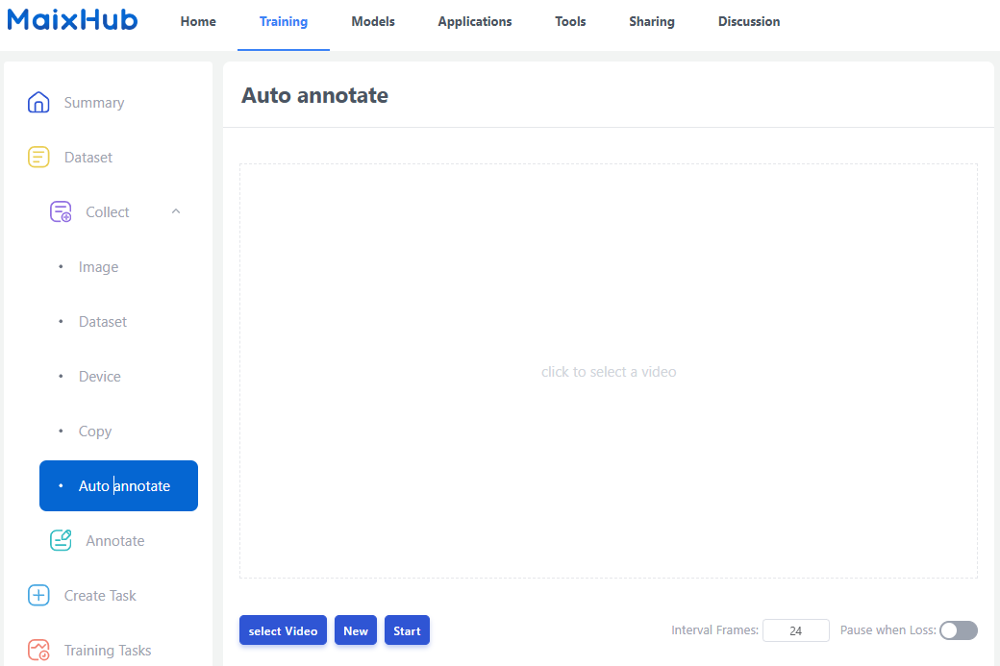
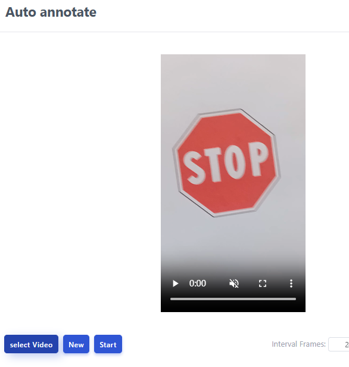
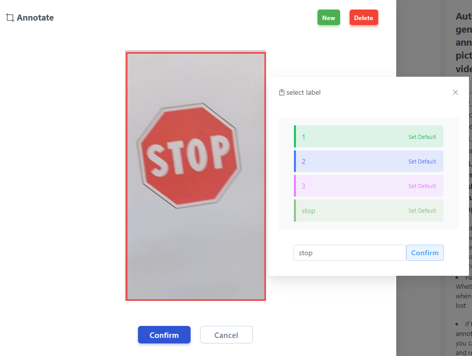
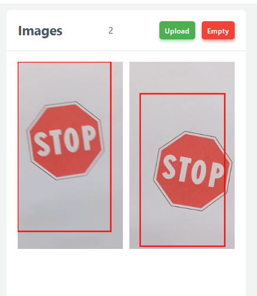
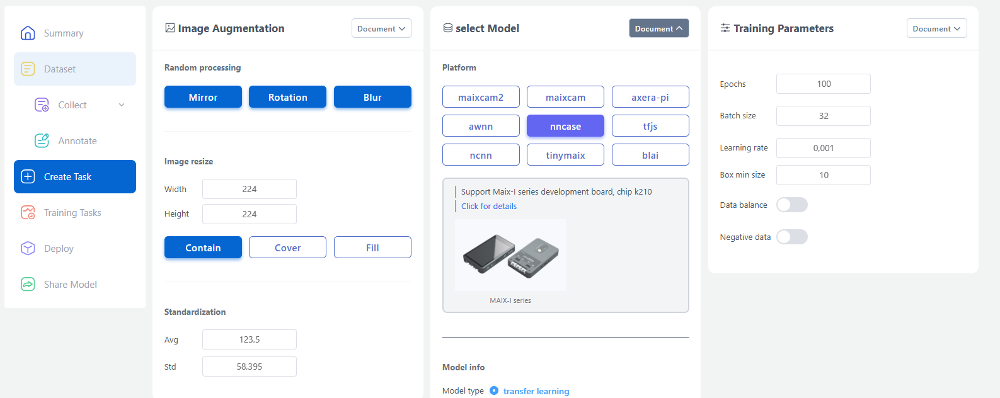
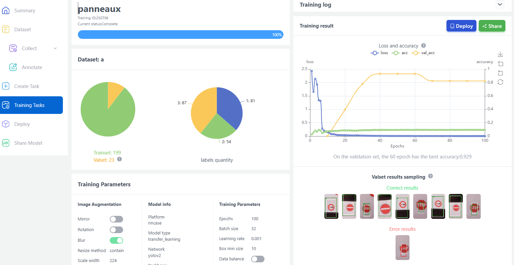
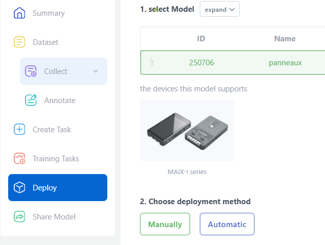

# Apprentissage par l'outil MaixHub

https://maixhub.com/model/training/project

- Créer un projet

- pour collecter des données, on va utiliser l'outil d'annotation automatique https://maixhub.com/model/training/project

   - créer des images papier, une pour chacune des images sur laquelle l'on veut entraîner le modèle
   - créer des vidéos (par le téléphone par exemple) sur chacune de ces images cibles. Le logiciel analysera ensuite ces vidéos, en extrayant automatiquement des vues fixes (24 images/s) en les associant à un label
   - chaque vidéo consiste à montrer une des images cible sous différents angles, différents agrandissement, différents cadrages
   - la durée de la vidéo doit permettre un nombre suffisant de vues individuelles (environ 50 vues pour une vidéo de 50s)
   - le training nécessite au moins 50 vues différentes
   - transférer les vidéos vers le PC
   - saisir une vidéo

   - avec l'option "new", configurer l'extraction des vues en définissant le label associé à toutes ces vues, ainsi que le cadrage par défaut

   - lancer l'extraction avec l'option "start"

   - terminer l'extraction avec l'option "Upload" et répéter cette opération pour toutes les vidéos de toutes les images à entraîner. Associer les labels de façon appropriée.

   - lancer la tâche d'entraînement en sélectionnant la plateforme (nncase pour K210) et les actions d'amélioration du set puis "start"

   - observer le déroulement de la tâche d'entraînement avec l'option "Training task"

   - Créer le kit avec le modèle entrainé avec l'option "Deploy"

Ce kit contient :
    - le modèle (fichier *.kmodel)
    - un fichier "main.py" que l'on devra modifier pour différentes options. Par exemple, on peut envoyer par UART le résultats des classifications.
    - il est recomandé de corriger les adresses de l'UART 

    fm.register(35, fm.fpioa.UART1_TX, force=True)
    fm.register(34, fm.fpioa.UART1_RX, force=True)

et configurer l'adresse de chargement du modèle:

    main(anchors = anchors, labels=labels, model_addr=0x300000, lcd_rotation=0)

- Installer le modèle avec l'outil "kflash_gui" à l'adresse "0x300000"
- exécuter le programme modifé selon vos souhaits
- les résultats sont envoyés sous le format:

      93:28:99:176:0:0.54:1

  - coordonnées de la zone de l'image détectée
  - id de la classe
  - probabilité de réussite de la détection
  - label identifié
  

