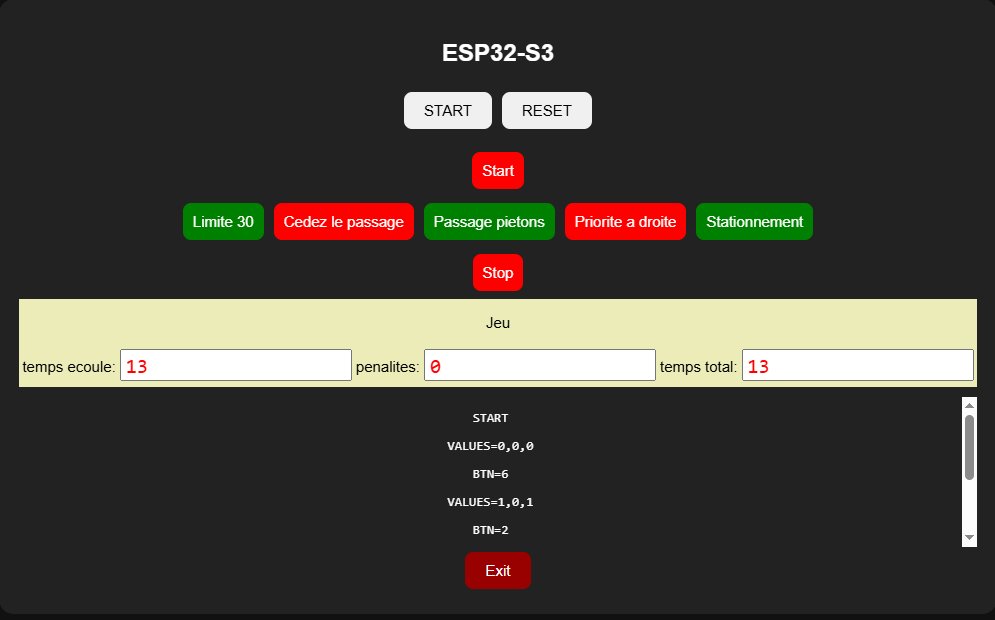

# Programme de base pour le jeu Robot

Le programme base.py implémente la connexion entre le cpu du Robot et l'écran de contrôle

Le principe de base consiste à recevoir les messages (canal espnow) qui reflètent les panneaux routiers détectés par la caméra du K210.

l'IHM de base.py montre tous les messages reçus et décode ces messages en allumant les boutons des panneaux.

Ensuite on implémente le protocole de jeu

- démarrage avec la détection du panneau START
- démarrage du chronomètre
- selon les panneaux détectés et selon les conditions du robot (vitesse) établissement de pénalités en temps
- détection du panneau STOP signale la fin du parcours, mesure du temps, addition des pénalités

