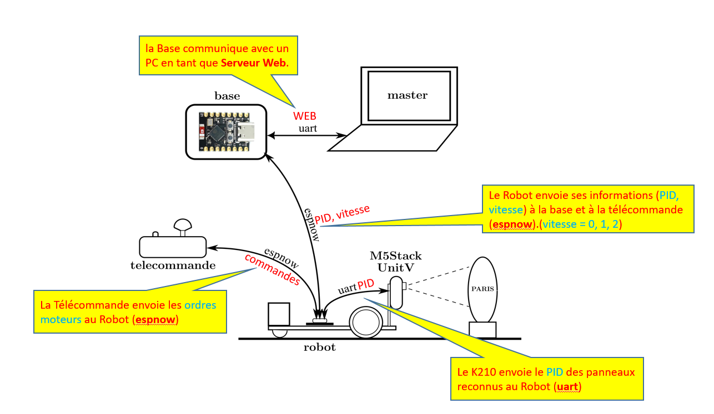
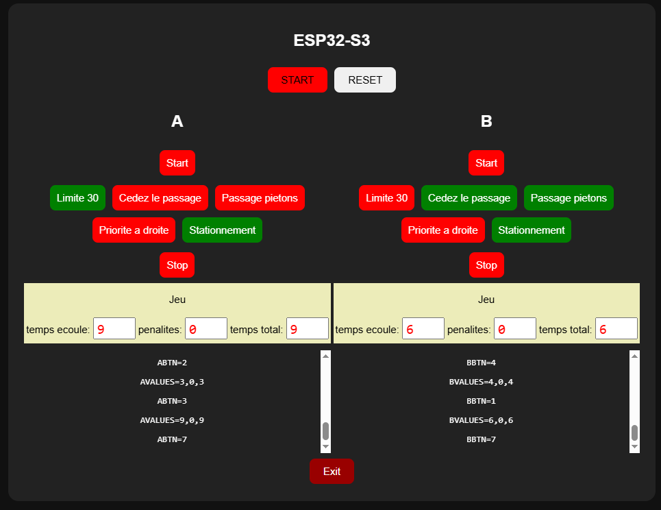

# Projet RobotServiceJeunesse2026

# Réflexions préparatoires pour le projet Jeunesse 2026

Le projet Jeunesse aura lieu dans une 1/2 journée dans les vacances pâques 2026 à choisir. 
Faire attention pour la durée: discuter avec les organisateurs pour obtenir réellement les 3 heures de le demie journée.

Principe: On garde le proto de l'année dernière mais avec quelques corrections (et/ou améliorations)

- Meilleurs moteurs plus rapides (choix des roues)
- Mener des tests pour fiabiliser l'utilisation de Esp now
- choisir le CPU de base: Esp32 s2 s3? C3?
  - impact: nombre de DIOs
  - tester la nécessité d'une vraie antenne
  - Nouveau proto (encombrement)
- Pilotage
- nouveau design pour le circuit
- utilisation d'un Microphone?
- IA ? Reconnaissance de symboles plutôt que caractères

- Refaire la télécommande. tests de Fiabilité
- Pb de multicanal sur la communication: tests
- utilisation de Powerbank 5V
- Reconnaissance par le k210 ?

## Organisation:
- distribuer les rôles pour les éléments à re-tester (moteurs, communication, reconnaissance, circuit, achats)
- mettre en place un Github 2026

# Benchmark ESP-now sur ESP32 S3

En menant mon benchmark esp-now j'ai compris qu'il faut flasher micropython >= 1.26 (au moins) car c'est à partir de cette version de micropython que Esp-now, est inclus dans micropython.
Par défaut 1.19 était flashé sur le ESP32-S3.
Pas grave mais il suffisait de le savoir.

# Convention d'identification pour ESP32-S3

ESP32-S3-N8R2

Chez Espressif, cette nomenclature signifie :

N8 → 8 MB de Flash
R2 → 2 MB de PSRAM

# IDF and HEAP in ESP32

list_of_tuples = esp32.idf_heap_info(esp32.HEAP_DATA )

each tuple in list_of_tuples is:
- total bytes
- the free bytes
- the largest free block

# Discussion mardi 13 janvier sur projet Jeunesse

- Alimentation Powerbank ok 18650 (vérifications pour la stabilité cependant)
- Gilles a préparé une nouvelle implémentation de l'ensemble, avec S2 (avec l'antenne améliorée)
  + une résistance de charge 
  + Logiciel sans changement 
  + Une néo pixel qu'il faudra intégrer au soft

- Détection de symboles avec k210 plutôt que nom des villes 

- Possibilité de fournir la version aux jeunes avec un capteur de distance à la place du k210

- on garde des options avec esp32 s3 cam ? mais l'option de base préférée est celle qui garanti le moindre changements

- Pb de la télécommande 
    + Batterie changer ?
    + version Ttgo esp32 avec afficheur + chargeur 
    + Ajouter vitesse lente.

# Programme de base pour le jeu Robot

Le programme base.py implémente la connexion entre le cpu du Robot et l'écran de contrôle

Le principe de base consiste à recevoir les messages (canal espnow) qui reflètent les panneaux routiers détectés par la caméra du K210.

l'IHM de base.py montre tous les messages reçus et décode ces messages en allumant les boutons des panneaux.

Etat d'avancement du programme de base:

- le programme base tourne sur un esp32
- c'est un serveur Web utilisant les SSE
- il est connecté espnow avec les CPUs de deux robots.
  => il faudra assurer que la mac adresse du ESP32 de base est déclarée
     dans le fichier mac_addr 
- actuellement la base est sensible aux valeurs d'ID de panneaux transférés via espnow mais il est 
  aussi sensible de façon équivalente aux boutons équivalents de l'IHM de la base
- il reste à ajouter la propagation des valeur de la vitesse (0, v1, v2) qui est nécessaire pour
  faire fonctionner le protocole du jeu.
- actuellement du protocole de jeu est simplifié
     - Le bouton global "START" lance les deux jeux pour les deux robots
     - on attend la reconnaissance du panneau "start"
     - ensuite tous les panneaux sont reconnus mais n'influence pas le jeu
     - en suite la reconnaissance de "stop" arrête le jeu
     - l'IHM met à jour le temps courant de parours
     - on ne comptabilise pas le pénalités pour l'instant
     - le bouton global "RESET" réinitialise les deux jeux

