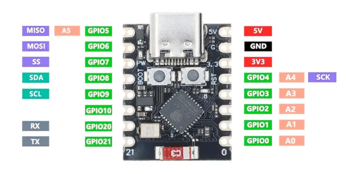

# Mise en place d'une communication série entre K210 et un ESP32

Dans le but de mettre en place une meilleure ergonomie de l'apprentissage pour des figures avec le K210, on teste la communication série UART.

On prépare une petite configuration

- un ESP32-C3 Super Mini 
- un K210 UnitV
- une diode pour visualiser le trafic
- deux logiciels 
  - envoi de messages par le ESP32
  - réception par le K210

