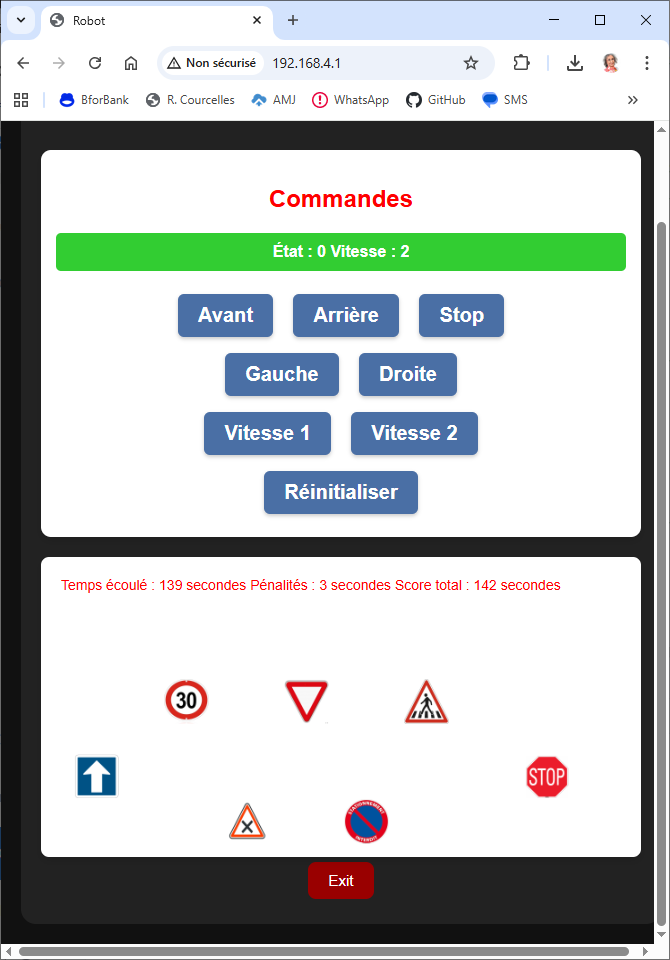
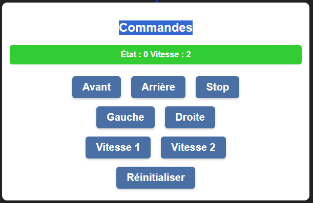
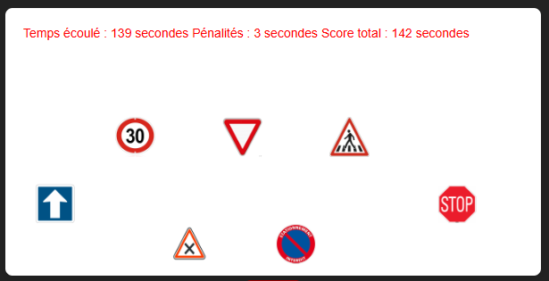

# Fonctionnement du simulateur de jeu

Le programme Python/control.py permet de simuler le jeu du robot.
(notez que ce programme a besoin de la librairie Python/server.py)

- Ce programme fonctionne sur un ESP32
- le programme démarre un serveur web avec deux zones IHM:
  - Zone de commandes qui émule la télécommande qui pilote les moteurs du Robot.
  - Zone de contrôle qui émule le trajet à parcourir par le robot.

## La zone de commandes

- émule la télécommande avec les commandes habituelles (y compris le choix des vitesses 1 et 2)
- montre aussi la commande de réinitialisation générale
## La zone de contrôle

- les panneaux à installer sur le trajet sont visualisés (sans préoccupation de leur localisaion réelle)
- cliquer sur un panneau émule la reconnaissance par le K210 (le panneau apparait encadré en rouge)
- une ligne d'information en haut de la zone donne les états du jeu (temps écoulé, pénalités, temps total)

Règle du jeu actuel:

- le jeu démarre en cliquant le panneau de la flèche bleue. Ceci démarre le jeu et initialise le temps et les pénalités
- différentes situations sont testées et apportent éventuellement de pénalités de temps
  - 30 exige que le robot soit en vitesse 1
  - laisser le passage, priorité à droite exige que le robot soit en vitesse 1
  - passage piéton stoppe le robot pendant quelques secondes
  - stationnement interdit exige que le robot ne soit pas à l'arrêt
  - stop arrête le jeu

## Evolutions futures

L'objectif est de connecter réellement l'ESP32 pilotage des moteurs (via espnow) avec le K210
Ainsi 
- les commandes reflètent les commandes envoyées par la télécommande
- les détections reflètent les détections du K210

Seule la commande "Réinitialiser" restera accessible par l'opérateur
